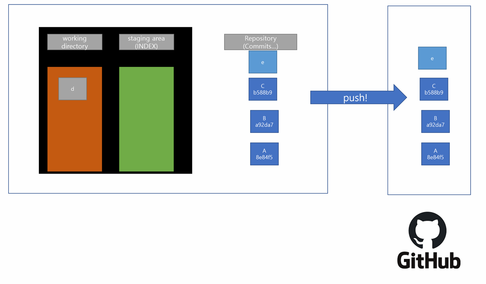

# 원격 저장소 활용(GitHub)

## 기초 활용

### 조회

```bash
$ git remote -v
origin  https://github.com/edutak/first1.git (fetch)
origin  https://github.com/edutak/first1.git (push)
```

### 추가 

```bash
$ git remote add <원격저장소이름> <url>
$ git remote add origin https://github.com/username/repository.git
```

* `origin` : 일반적으로 많이 활용되는 원격저장소 이름

### 삭제

```bash
$ git remote rm <원격저장소이름>
$ git remote rm origin
```


## 원격 저장소 push

> Update remote refs along with associated objects (commit)
```bash
$ git push <원격저장소이름> <브랜치이름>
$ git push origin master
```


## pull

> Fetch from and integrate with another repository or a local branch
```bash
$ git pull <원격저장소이름> <브랜치이름>
$ git pull origin master
```


## 원격 저장소 clone

> Clone a repository into a new directory
```bash
$ git clone <원격저장소주소>
$ git clone https://github.com/username/repository.git
```

* 원격저장소 이름의 폴더가 생성됨.




